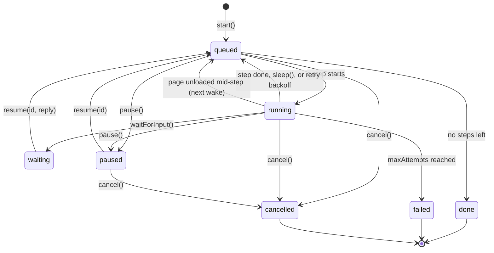
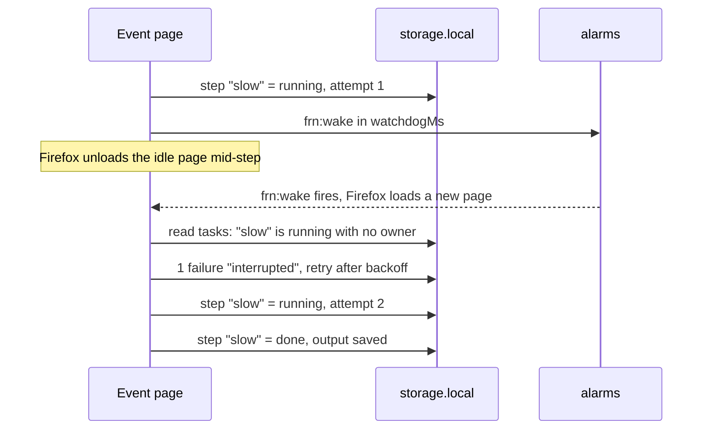
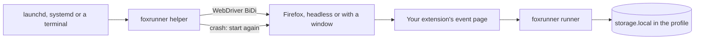
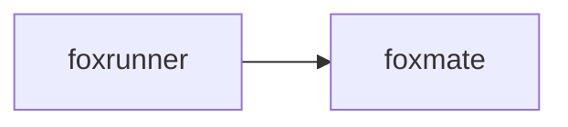

# foxrunner

Durable agent tasks in Firefox: steps that resume, schedules, and a headless helper.

A foxrunner task is a list of named steps. The runner saves each step's state before the step starts and after it ends. Firefox unloads an extension's event page when it is idle, and it can also crash or restart. In each case the task goes on from the last finished step.

foxrunner has two parts:

- A library for the extension's event page. It runs tasks, retries, sleeps on alarms, and runs schedules.
- A command, `foxrunner helper`, that keeps Firefox running with your extension on a mini PC or a server.

## Install

```bash
npm i foxrunner
```

Install the add-on from AMO: [addons.mozilla.org/firefox/addon/foxrunner](https://addons.mozilla.org/firefox/addon/foxrunner/)
(pending AMO review; the link works after approval).

foxrunner needs Firefox 153 or later. The helper needs Node 24 or later.

## Example

In your extension's background script (an event page in Manifest V3):

```js
import { createRunner, storageAreaStore } from "foxrunner";

const runner = createRunner({ store: storageAreaStore(browser.storage.local), browser });

runner.define("report", [
  { name: "collect", run: (ctx) => ({ url: ctx.input.url }) },
  { name: "wait", run: (ctx) => ctx.sleep(2 * 60_000) },
  {
    name: "send",
    retry: { maxAttempts: 5, backoffMs: 2000 },
    run: async (ctx) => {
      const res = await fetch(ctx.results.collect.url, { headers: { "Idempotency-Key": ctx.idempotencyKey } });
      if (!res.ok) throw new Error(`HTTP ${res.status}`);
      return { status: res.status };
    },
  },
]);

runner.schedule("report", { cron: "0 7 * * 1-5", input: { url: "https://example.com/" } });
```

The manifest needs the `storage` and `alarms` permissions, and a host permission for the URL that the step fetches. Call `define()` and `schedule()` in the first turn of the script, so they are ready on every wake.

The same API runs in Node with an in-memory store. With no `browser` object, nothing wakes the runner, so call `tick()` yourself:

```js
import { createRunner, memoryStore } from "foxrunner";

const runner = createRunner({ store: memoryStore() });
runner.define("greet", [
  { name: "name", run: (ctx) => ctx.input.name.trim() },
  { name: "say", run: (ctx) => `Hello, ${ctx.results.name}` },
]);

const task = await runner.start("greet", { name: " Ada " });
await runner.tick();
console.log((await runner.get(task.id)).steps.at(-1).output);
// Hello, Ada
```

## Use cases

| Who | What they build | How foxrunner helps |
|---|---|---|
| A developer of a browser agent | Scheduled agent jobs, such as "check my orders every morning" | `schedule()` runs the job on a cron string. A run missed while Firefox was closed runs once at the next start. |
| An automation author | A long form-filling flow that waits for an email code | Each page of the form is a step. `waitForInput()` parks the task until the user types the code into `resume()`. |
| A person who watches prices or pages | Nightly scraping and checks | Steps retry with backoff. A step cut short by an unload runs again, and the idempotency key stops a second side effect. |
| An extension author | Background work that must finish, such as an upload queue | Each step is saved, so the queue survives event page unloads, Firefox restarts and crashes. |
| A kiosk or home-lab owner | An always-on Firefox on a mini PC or a server | `foxrunner helper` keeps Firefox and the extension running, and starts Firefox again after a crash. |
| A test engineer | Firefox E2E tests that restart the browser with one profile | `launchFirefox()` from `foxrunner/helper` starts Firefox with a persistent profile and a pinned extension UUID. |

## How it works

A task moves through these states. Each change is saved before anything else happens.



foxrunner does not try to keep the event page alive. Firefox unloads it when it is idle (after 30 seconds by default), and open ports do not stop that. Instead, foxrunner keeps one alarm, `frn:wake`, set to the next moment a task needs the page:

- the end of a sleep or a retry backoff
- the next schedule slot
- `watchdogMs` (default 30 s) ahead while a step runs

When the page loads again, the runner reads the stored tasks. A step that is still marked `running` with no owner was cut short. It counts as one failed attempt and runs again.



Nothing in an extension runs while Firefox is closed. The helper covers that gap:



## API

`createRunner(options)` returns a runner. Options:

| Option | Default | What it does |
|---|---|---|
| `store` | required | Where records live: `storageAreaStore(browser.storage.local)` or `memoryStore()` |
| `browser` | none | The `browser` object. The runner adds `alarms.onAlarm`, `runtime.onStartup` and `runtime.onInstalled` listeners. |
| `retry` | `{ maxAttempts: 3, backoffMs: 1000, factor: 2, maxBackoffMs: 60000 }` | Retry options for steps that set none |
| `watchdogMs` | `30000` | How far ahead the wake alarm is while a step runs |
| `graceMs` | `60000` | A schedule slot later than this counts as missed |
| `maxOutputBytes` | `1000000` | Largest step output, in JSON characters |
| `locks` | `navigator.locks` | Locks that give each task one owner across extension pages |
| `autoTick` | `true` | Check the stored tasks once, right after `createRunner()` |

| Method | What it does |
|---|---|
| `define(name, steps)` | Defines a task. A step is `{ name, run(ctx), retry? }`. |
| `start(name, input, { id }?)` | Saves and starts a task. With the same `id`, it returns the first task, also when two pages call it at once. |
| `schedule(name, { every \| cron, input, catchUp, overlap, id })` | Runs a task every `every` ms (at least 60000) or on a 5-field cron string in local time. `catchUp`: `"once"` (default) or `"skip"`. `overlap`: `"skip"` (default) or `"allow"`. Calling it again keeps the next slot. |
| `unschedule(id)`, `schedules()` | Removes or lists schedules. |
| `get(id)`, `list()` | Reads one task or all tasks, newest first. |
| `pause(id)`, `resume(id, reply?)`, `cancel(id)` | Controls a task. `resume` also answers a waiting step. |
| `tick()` | Runs every due task and schedule, and waits for the work in this page. |
| `on(event, fn)` | Events in this page: `change` (a saved task), `step` (a step ended), `error` (a skipped record or a failed write). Returns a function that removes the listener. |

A step's `run(ctx)` gets `taskId`, `input`, `results` (earlier outputs by step name), `attempt`, `idempotencyKey` (the same for every attempt), `signal` (aborts on pause or cancel) and `reply`. It returns JSON, `ctx.sleep(ms)`, or `ctx.waitForInput(prompt)`.

Also exported: `memoryStore`, `storageAreaStore`, `parseTask`, `parseCron`, `nextCron`, and the record types. `foxrunner/helper` exports `launchFirefox`, `runHelper`, `findFirefox` and `stableUuid` for Node.

## CLI

```bash
npx foxrunner helper --extension ./my-extension --profile ~/.foxrunner/profile
```

| Flag | Default | What it does |
|---|---|---|
| `--extension <dir>` | required | An unpacked extension folder with a gecko id in its manifest |
| `--profile <dir>` | `~/.foxrunner/profile` | The Firefox profile. The helper makes the folder if it is missing. |
| `--headed` | off | Show a Firefox window |
| `--firefox <path>` | `FIREFOX`, then the usual install paths | The Firefox binary |
| `--max-restarts <n>` | `5` | Crashes allowed in 10 minutes before the helper stops |
| `--restart-delay <ms>` | `2000` | Wait before a restart. It doubles for each recent crash, up to 60 s. |

The helper logs one line per event to stdout, for example `firefox started pid=4242 extension=moz-extension://…/`.

| Exit code | Meaning |
|---|---|
| 0 | Stopped by SIGINT or SIGTERM. Firefox is closed. |
| 1 | Bad command line |
| 2 | Cannot find Firefox, cannot read the extension, or the first start failed |
| 3 | Crash loop: more than `--max-restarts` crashes in 10 minutes |

The helper installs the extension as a temporary add-on on each start. It pins the extension's UUID from its gecko id and sets Firefox to keep the storage of a removed temporary add-on, so tasks survive restarts.

## Try the demo

```bash
pnpm install
pnpm e2e
```

`pnpm e2e` builds the demo extension in `extension/` and runs it in a real Firefox. It writes `artifacts/e2e-<date>.json`, `artifacts/helper-<date>.json` and a popup screenshot. To try the popup yourself, run `pnpm build:ext` and load `dist-ext/manifest.json` from `about:debugging`.

## Firefox APIs used

| API | Why |
|---|---|
| [`alarms`](https://developer.mozilla.org/en-US/docs/Mozilla/Add-ons/WebExtensions/API/alarms) | One wake alarm for sleeps, retries, schedules and the watchdog |
| [`storage.local`](https://developer.mozilla.org/en-US/docs/Mozilla/Add-ons/WebExtensions/API/storage/local) | Task, schedule and control records |
| [`runtime.onStartup` / `onInstalled`](https://developer.mozilla.org/en-US/docs/Mozilla/Add-ons/WebExtensions/API/runtime) | Wake the runner when Firefox starts or the extension loads, to resume tasks and catch up schedules |
| [MV3 background scripts (event page)](https://developer.mozilla.org/en-US/docs/Mozilla/Add-ons/WebExtensions/Background_scripts) | Where the runner lives. It unloads when idle, so the runner saves everything. |
| [`runtime.onMessage` / `sendMessage`](https://developer.mozilla.org/en-US/docs/Mozilla/Add-ons/WebExtensions/API/runtime/onMessage) | The demo popup talks to the event page |
| [`runtime.reload`](https://developer.mozilla.org/en-US/docs/Mozilla/Add-ons/WebExtensions/API/runtime/reload) | The E2E test reloads the demo mid-task |
| [Web Locks (`navigator.locks`)](https://developer.mozilla.org/en-US/docs/Web/API/Web_Locks_API) | One owner per task across extension pages |
| [`AbortController`](https://developer.mozilla.org/en-US/docs/Web/API/AbortController) | `ctx.signal` for pause and cancel |
| [`crypto.randomUUID`](https://developer.mozilla.org/en-US/docs/Web/API/Crypto/randomUUID) | Task ids |
| [WebDriver BiDi](https://firefox-source-docs.mozilla.org/remote/index.html) (outside the extension) | The helper starts Firefox and installs the extension through puppeteer-core |

## Limits

- Nothing runs while Firefox is closed, unless the helper runs. foxrunner does not install the helper as a service. Run it under launchd, systemd or Task Scheduler yourself.
- A step runs at least once, not exactly once. A step cut short runs again. Use `ctx.idempotencyKey` to skip work that already happened.
- A step must end before Firefox unloads the idle event page (30 seconds by default). Use `ctx.sleep()` for long waits. A step that always needs more time fails after `maxAttempts`.
- A cut-short step is found only at the next wake, up to `watchdogMs` later.
- Schedules run at most once a minute. Cron has 5 fields in local time, with no names such as `MON`.
- A cron slot in the hour that a spring-forward clock change skips (such as `0 2 * * *`) does not run that day. Vixie cron runs it after the change.
- Events from `on()` reach only the page that runs the runner. Other pages read storage or send a message.
- Finished tasks stay in storage. There is no delete or retention API yet.
- `list()` reads all of `storage.local`, so it slows down with many thousands of records.
- The helper loads unpacked extension folders only, not `.xpi` files.
- foxrunner does not use the `idle` API yet, so it cannot hold heavy steps until the user is away.
- The demo's content script on `http://127.0.0.1/*` exists only for the E2E test.

## Part of the fox primitives



foxrunner depends on no other fox repo. [foxmate](https://github.com/pooriaarab/foxmate), the reference agent, uses it for scheduled and long-running agent tasks. See all repos at [github.com/pooriaarab](https://github.com/pooriaarab).

## License

MIT
